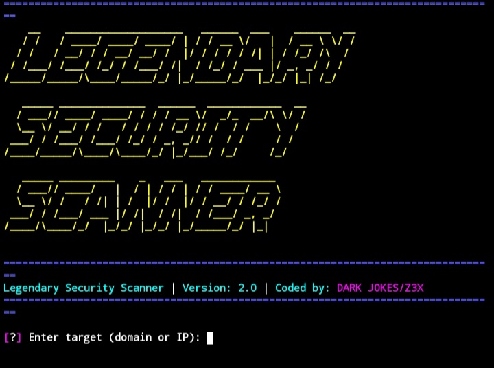

🌐 Legendary Security Scanner - جمع المعلومات**  

<!-- الصورة تظهر مباشرة مع شرح تحتها -->



**أداة شاملة لتحليل النطاقات والخوادم**  

### **✨ المميزات:**  
- 🔍 فحص DNS متقدم (10+ سجلات)  
- 📅 تحليل WHOIS شامل  
- 🚪 مسح 1200+ بورت  
- 🌐 اكتشاف 200+ نطاق فرعي  
- 🔐 تحليل شهادات SSL/TLS  

### **⚙️ المتطلبات:**  
```bash
pip install pyfiglet requests dnspython whois tqdm tabulate
```

المطور : Z3X
